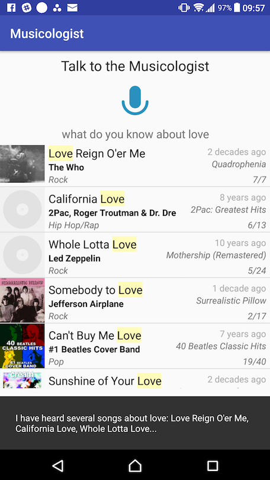

Musicologist is a research project exploring the intersection of conversational interfaces and search UIs.
 

# [Presentation on Algolia's forum](https://discourse.algolia.com/t/the-musicologist-search-as-a-conversation/2928/5)

# Features
- Search for songs by artist or theme
- Voice input, voice output
- Rich search results UI

# Examples
- > Do you know songs by the rollin stun?
- > Any music released by Eminim?  
- > Do you know anything about love?
- > Did you hear songs by Zeppelin?
- > What do you know on California?

# Getting started
- Git clone or download the code
- Run `cd android && ./gradlew installDebug` to install the app on a connected device/emulator

# Architecture
- Mobile frontend in [`/android`](/android)
  - Speech to text using a [`SpeechRecognizer`](https://developer.android.com/reference/android/speech/SpeechRecognizer.html)
  - Results displayed with **[InstantSearch Android](https://community.algolia.com/instantsearch-android/)**
  - Text to speech using the [TTS Engine](https://developer.android.com/reference/android/speech/tts/TextToSpeech.Engine.html)
- API.AI [agent](agent.zip) for NLU
- A [backend](https://github.com/PLNech/musicologist-backend/) connecting the agent to Algolia
